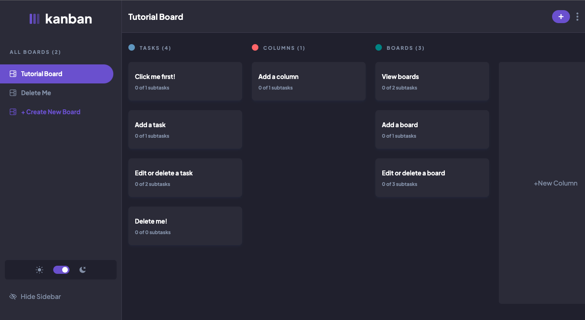

# Kanban App

This app is my implementation of this [Frontend Mentor challange](https://www.frontendmentor.io/challenges/kanban-task-management-web-app-wgQLt-HlbB)

**Link to project:** https://kanban-flame.vercel.app/

## How It's Made:

**Tech used:** React, TailwindCSS

My main goal for this project was to make an accessible app that is as close to the design mock-ups as possible. I used React Context to handle state management and LocalStorage to persist the state of the app.

## Lessons Learned:

I learned about how to create modals using useProtal, and how to control the tabindex to make the app easier to use for keyboard-only users.

## Optimizations

This app can become more accessible by allowing tasks to be opened with keyboard commands, and by changing the focus to the first element in the modal once a user opens the modal.

Although this app persists data, it uses LocalStorage which does not allow a single user to use the app on mulitple devices. A good optimization would be to add user authentication so that a user can see their kanban boards on multiple devices.

## Running this project locally

1. Clone this project locally.
2. Run `npm install` to install all dependencies.
3. Run `npm run dev` to get the project running locally.
